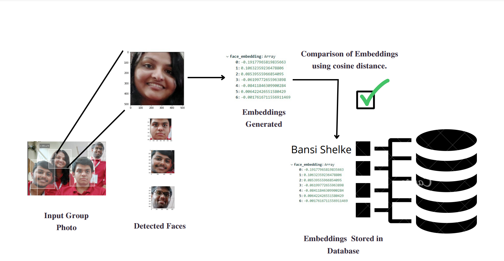

## Smart Attendance App

The main functionality of the application is to detect and recognize the faces of multiple employees/workers from a group photo and subsequently mark their attendance. The backend is a Flask API that makes use of the DeepFace library to detect faces from images. Face embeddings are then created from these detected faces which are then cross referenced with those in the database to get the their identity and mark their attendance.

We have designed an android application as well as a website to act as a user interface make requests to the Flask API.

The image below illustates the working of the app.

